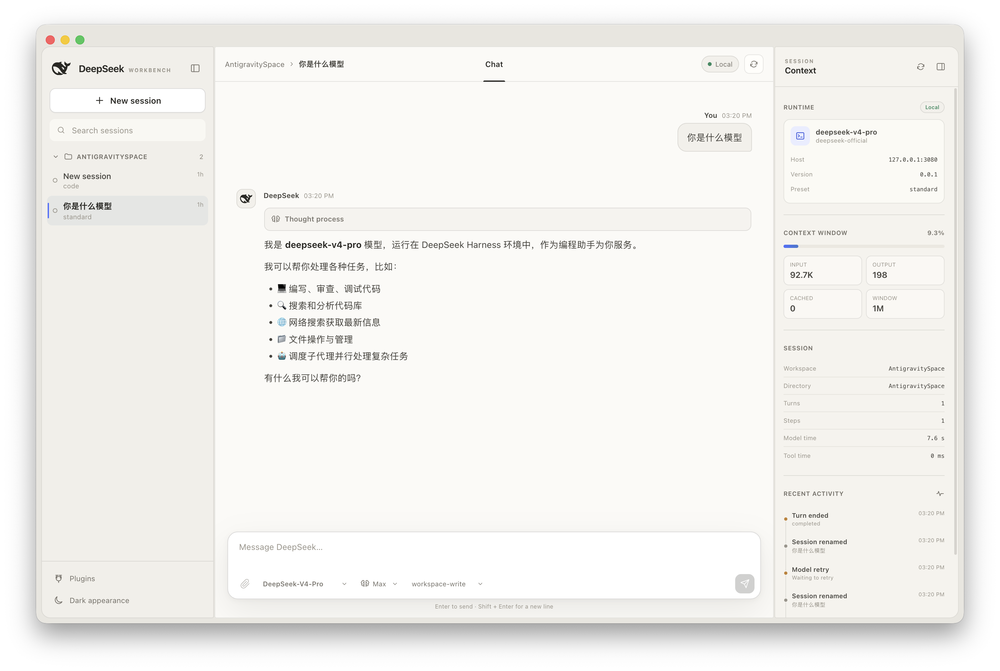
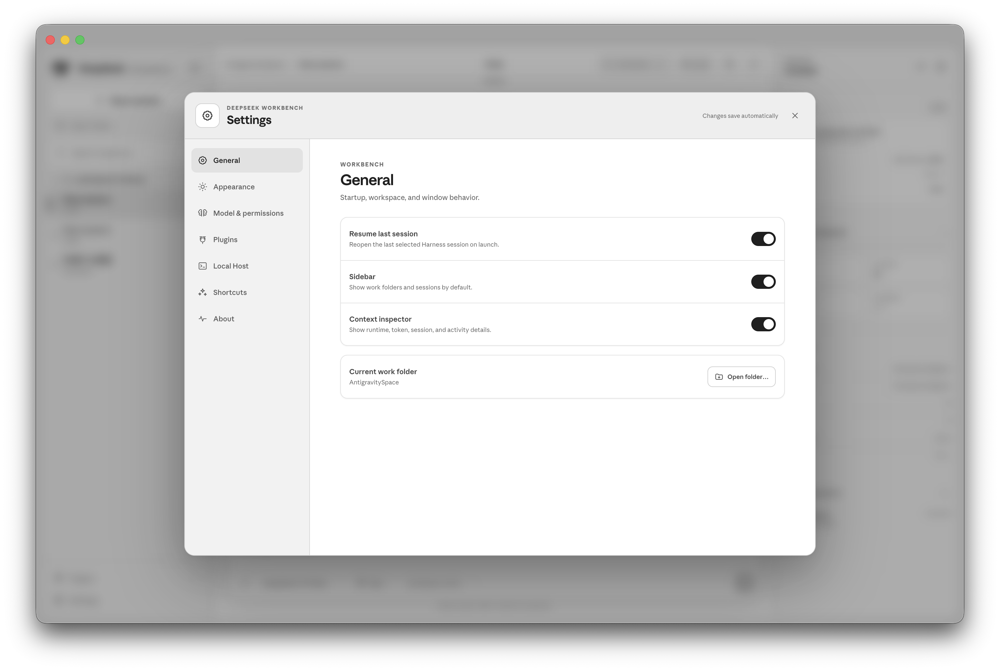
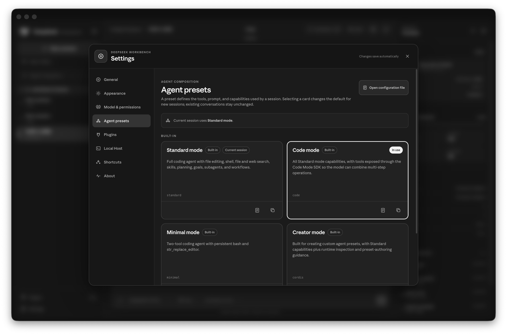
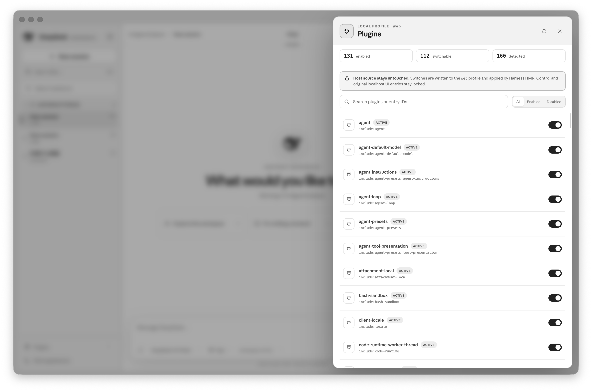
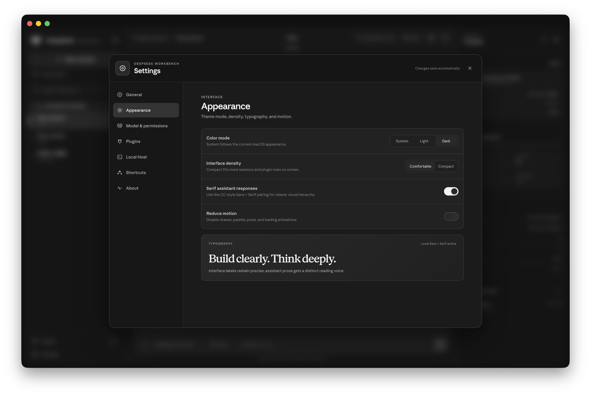

# DeepSeek Harness

<p align="center">
  
</p>

<p align="center"><strong>A native macOS and Windows workbench for DeepSeek Harness, Codex, and local coding workflows.</strong></p>

<p align="center">
  <a href="https://github.com/Eentropie/deepseek-harness-macos-gui/releases/latest">Download latest</a> ·
  <a href="./docs/USAGE.md">Usage guide</a> ·
  <a href="./docs/USAGE.zh-CN.md">中文使用说明</a>
</p>

DeepSeek Harness is a standalone macOS and Windows desktop GUI for a local DeepSeek Harness Host. It keeps the upstream Harness repository and its original `http://127.0.0.1:3080` web interface unchanged.

> The screenshots below are real desktop captures. The GUI is a separate client; it does not replace, patch, or embed the Local Host.

## What is included

- Local desktop window with no browser dependency
- Work-folder and session switcher
- Native workspace/session menus, drag reordering, pin/unread state, and a collapsed Archived section
- Native operating-system folder picker
- Command palette and keyboard shortcuts
- Model, reasoning-effort, and permission controls
- DeepSeek plus account-scoped ChatGPT/Codex models through the local Codex CLI login
- Native Harness Agent presets with Standard, Code, Minimal, and Creator modes
- Session context and activity inspector
- Shared Context, file Review/editor, multi-Sidechat, approval, and Subagent side panel
- Center-column terminal with streamed output and `Command-J` / `Ctrl-J` toggle
- Live plugin inventory with one-click enable/disable for safe entries
- Full Settings center for startup, layout, appearance, model, permissions, plugins, Host status, shortcuts, and app information
- System, light, and dark appearance modes with comfortable or compact density

The visual system uses only black, white, and neutral grays. On macOS, the desktop runtime can read already-installed UI Sans and Serif variable fonts through fixed, read-only font routes. The font files are not copied into this project or the application package. Windows uses Segoe UI Variable and the configured system Serif fallback when those local sources are unavailable.

## Preview

<p align="center">
  
  
</p>

<p align="center">
  
  
</p>

## Quick start

1. Download the [latest macOS DMG/ZIP or Windows installer](https://github.com/Eentropie/deepseek-harness-macos-gui/releases/latest).
2. Launch the app. The first-run wizard checks Node.js, detects an existing Harness checkout or installed package, and can start the Local Host for you.
3. Add the write-only DeepSeek API key, verify the locally installed/signed-in Codex CLI if desired, and choose a work folder.
4. Select **Run environment check**. When every required item is ready, enter the workbench.

The Host remains a separate local process at `127.0.0.1:3080`; the app starts it without modifying or embedding the upstream localhost interface. If automatic detection is unavailable, the wizard provides the exact install/login links and the manual commands below.

The complete setup, DeepSeek API, Codex, external-provider, permissions, and troubleshooting walkthrough is in [the usage guide](./docs/USAGE.md). 中文用户可直接阅读[中文使用说明](./docs/USAGE.zh-CN.md)。

## Run it

Start the existing Harness Host in one Terminal window (replace the path with your local checkout):

```sh
cd /path/to/deepseek-harness
corepack pnpm dsh web
```

Then open the desktop application:

```sh
open "release/mac-arm64/DeepSeek Harness.app"
```

On Windows, start the same Host from PowerShell and then run either the installed app or the unpacked build:

```powershell
Set-Location C:\path\to\deepseek-harness
corepack pnpm dsh web

& ".\release\win-unpacked\DeepSeek Harness.exe"
```

The desktop app talks only to the local Host at `127.0.0.1:3080`. It does not replace or patch that Host.

For ChatGPT/Codex models, the desktop app also starts the locally installed `codex app-server`. Codex keeps ownership of authentication; the workbench never reads or copies its login token.

## DeepSeek and Codex models

The same model selector contains two live groups:

- **DeepSeek:** models returned by Harness. Their reasoning selector currently switches among `Off`, `High`, and `Max`.
- **ChatGPT · Codex CLI:** models returned by the signed-in Codex account. Every model supplies its own list, such as `Low`, `Medium`, `High`, `X-High`, `Max`, and, where available, `Ultra`.

Changing the model or reasoning effort takes effect on the next turn and does not restart the Host or desktop app. DeepSeek and Codex keep separate native conversation histories under the selected desktop session; switching provider restores the corresponding real thread. Codex turns are limited to the selected Harness work folder with a workspace-write sandbox.

### External agents and provider routes

- **Codex CLI** is the first-class external-agent integration. The GUI starts `codex app-server --listen stdio://` on demand, reads its live model catalog, and keeps Codex authentication in the CLI-owned credential store.
- **DeepSeek and other LLM providers** are Host provider routes. Configure them through **Settings → Models & credentials**; the GUI never treats an API key as conversation content.
- **Other agent CLIs** such as Claude Code or OpenCode are not auto-discovered as executable agents in this release. They can be used separately, or connected as model/provider routes when the Host exposes a compatible adapter. Making another agent first-class requires an adapter for the Codex App Server contract or a future desktop bridge.

See [External agents and API setup](./docs/USAGE.md#other-providers-and-external-agents) for executable discovery, Codex login, DeepSeek API keys, OpenAI-compatible gateways, reasoning levels, and permission boundaries.

## Work folders

Choose **Open folder…** in the sidebar or press `Command-O` on macOS / `Ctrl+O` on Windows. The native folder picker registers the selected path as a Harness workspace and opens its most recent session. If the folder has no session yet, the app creates one blank session. Click any folder heading in the sidebar, or use the command palette, to switch later.

## Session management

Right-click a session, double-click it, or use the chat `…` menu for native actions such as pin, rename, archive, mark unread, reveal/copy workspace details, fork, export, open in a new window, and delete.

Archived sessions appear in the collapsed **Archived** group at the bottom of the sidebar. **Delete chat…** removes a session from this desktop client after confirmation, but the current Harness Host has no permanent session-delete API, so its underlying Host log remains on disk. Deletion is disabled while the session is running.

For the exact Host parity boundary and recommended next features, see [HOST_CAPABILITY_AUDIT.md](./HOST_CAPABILITY_AUDIT.md).

## Side panel, Review, Sidechat, and Terminal

The right side panel shares one fixed area among four views:

- **Context:** the complete runtime, token, session, task, goal, skills, and activity view.
- **Review:** pending approvals plus changed-file discovery, Git diff reading, and guarded editing of existing text files inside the selected work folder. Saves use an expected-content hash so a file changed by another process is not overwritten.
- **Sidechat:** side threads are owned by the selected main chat. Switching the main chat switches its Sidechat collection; one main chat can keep multiple Sidechats, each with its own draft, transcript, model, reasoning effort, and permission mode.
- **Agents:** direct Subagent status and transcript navigation.

The bottom Terminal opens only in the center conversation column. Toggle it with the top-right layout control or `Command-J` / `Ctrl-J`.

## Plugin manager

Choose **Plugins**, select **Manage plugins** from `Command-K`, or press `Command-Shift-P`.

Switchable entries are ordinary tools, skills, workflows, and model extensions. A change is written atomically to the local `web` profile patch and applied by Harness HMR. The original config is backed up first and restored automatically if the requested runtime state does not appear.

Locked entries are intentional:

- Host control-plane and transport plugins are required to keep RPC, sessions, HMR, and realtime events alive.
- Original `ui-*` and `client-*` entries stay locked so the existing localhost interface is preserved.
- Runtime-generated entries do not have a stable config ID, so persisting a toggle for them would be ambiguous.

No plugin is changed merely by opening the manager.

## Agent presets

Open **Settings → Agent presets** to use the Host's native per-session composition system. This is not a local display preference: the roster comes from `agentPreset.list`, and selecting a card writes the `agent-presets.default` setting used when Harness creates later sessions.

- **Standard mode:** complete coding-agent toolset, skills, planning, goals, subagents, and workflows.
- **Code mode:** Standard capabilities presented through the Code Mode SDK for multi-step TypeScript tool programs.
- **Minimal mode:** persistent shell plus the focused replacement editor.
- **Creator mode:** Standard capabilities plus runtime inspection and preset-authoring guidance.

The page distinguishes the default (`In use`) from the preset mounted by the current session. Existing conversations are not recomposed when the default changes.

Shipped presets can be viewed read-only or copied. A copy is created by the Host under its user-writable preset root; no arbitrary composition text or filesystem path crosses the desktop bridge. Custom presets can be opened in their own directory and deleted after confirmation. **Draft a custom preset with Creator mode** creates a blank `cordis` session and prepares an authoring prompt.

**Open configuration file** delegates to the Host's native settings-document opener. The desktop renderer cannot choose the file path.

## Settings

Choose **Settings**, click the gear button, select it from `Command-K`, or press `Command-,`. Preferences apply immediately and persist locally.

- **General:** resume the last session, choose the default sidebar and inspector state, and open or switch the current work folder.
- **Appearance:** follow the operating-system theme or force light/dark mode, select comfortable/compact density, enable Serif assistant responses, and reduce motion.
- **Model & permissions:** choose the active session model, reasoning effort, and permission preset.
- **Models & credentials:** inspect every Host provider route, activate additional adapters, safely set or remove write-only API keys, override endpoints, and discover advertised models without changing configuration.
- **Harness settings:** edit every namespace exposed by the live redacted Host schema with per-field reset, revision checks, and restart/live-apply labels.
- **Agent presets:** choose the default session composition and manage safe copy-only custom presets.
- **Plugins:** inspect live enabled/controllable counts and open the full plugin manager.
- **Local Host:** see connection, version, and working-directory information and reconnect to the fixed local Host.
- **Shortcuts / About:** review keyboard controls, architecture, signing, and security boundaries.

The Appearance page reports whether both local font families are active and includes a live Serif sample, so the typography source is directly visible rather than inferred from styling.

Stored credentials are never read into the renderer. The Host returns only whether a named credential is configured, its source, and whether it is writable; replacement values travel one way through the restricted desktop bridge.

## Shortcuts

| Shortcut | Action |
| --- | --- |
| `Command-K` | Open command palette |
| `Command-O` | Add or switch work folder |
| `Command-N` | New session |
| `Command-B` | Collapse or expand sidebar |
| `Command-J` | Toggle bottom Terminal panel |
| `Command-Shift-I` | Hide or show inspector |
| `Command-,` | Open Settings |
| `Command-Shift-P` | Open plugin manager |
| `Escape` | Close the active overlay |

On Windows, replace `Command` with `Ctrl`; the application displays the platform-correct labels automatically.

## Build and verify

```sh
cd /path/to/deepseek-harness-gui
corepack pnpm install
corepack pnpm check
corepack pnpm test
corepack pnpm pack:mac
corepack pnpm dist:mac
corepack pnpm pack:win
corepack pnpm dist:win
```

Outputs are:

- macOS unpacked: `release/mac-arm64/DeepSeek Harness.app`
- macOS installer/archive: `release/DeepSeek-Harness-0.2.0-arm64.dmg` and `.zip`
- Windows unpacked: `release/win-unpacked/DeepSeek Harness.exe`
- Windows NSIS installer: `release/DeepSeek-Harness-0.2.0-Windows-x64.exe`

These local builds are unsigned. macOS may require Control-click → **Open** once. Windows SmartScreen may show an unrecognized-publisher warning; verify the package source and checksum before choosing **Run anyway**. Production distribution should use Apple Developer ID and Authenticode signing respectively.

For complete Windows installation, Host, Codex CLI, security, and validation notes, see [WINDOWS.md](./WINDOWS.md).

## Configuration touched by plugin toggles

Plugin toggles write only the managed block in:

```text
~/.dsh/profiles/web/cordis.patch.yml
```

They do not edit the upstream Harness checkout.
